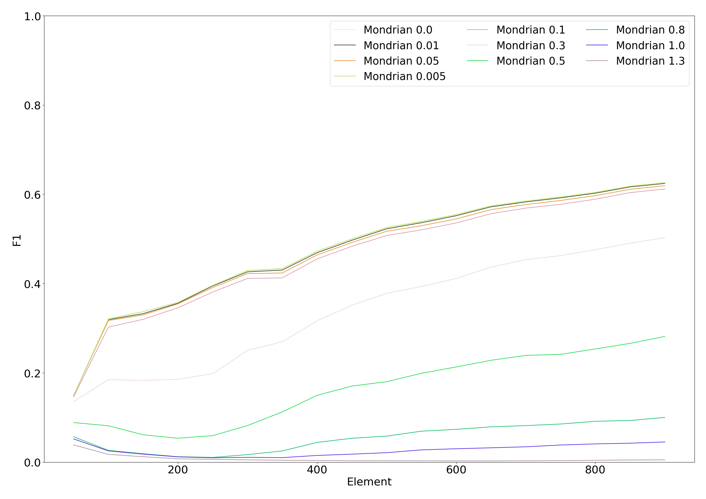
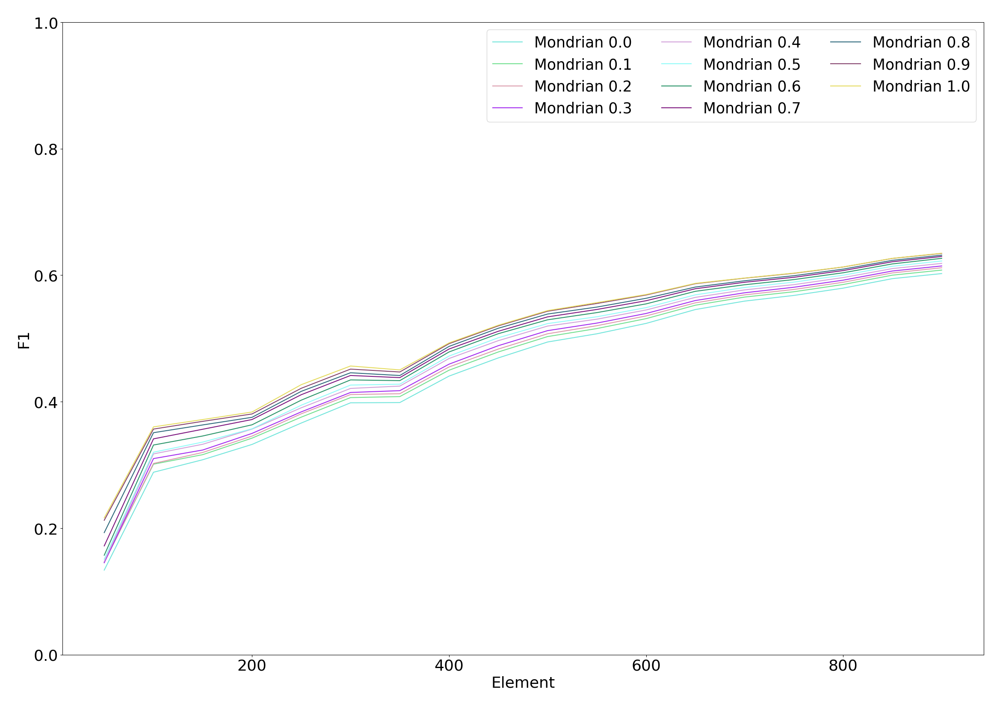
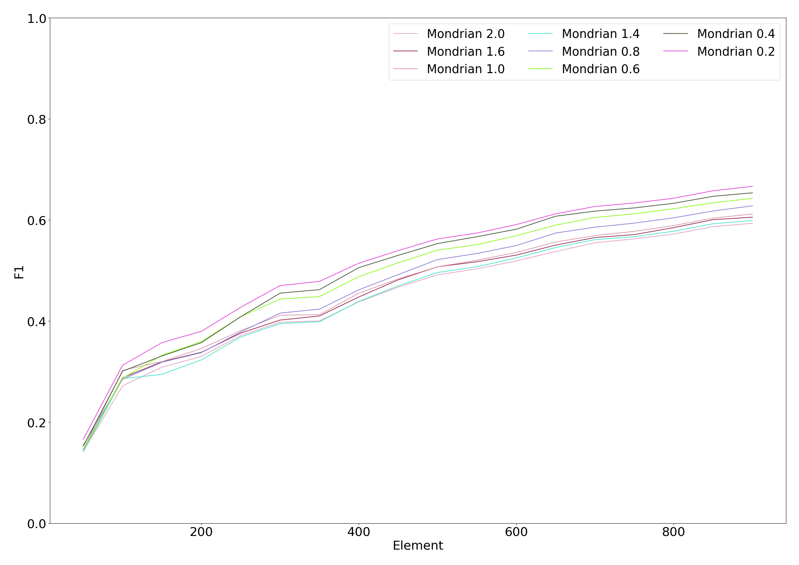

paper-benchmark
===============

Requirements
------------
This benchmark requires the following software:
- Git:: To download the source codes, the modules, and the datasets.
- gcc:: To compile.
- Panda, Seaborn, Matplotlib:: Used plot the figures.

Setup the repository
--------------------
First we clone the repository and we initialize the submodules.
```
git clone https://github.com/azazel7/paper-benchmark.git benchmark
cd benchmark
git submodule init
git submodule update
```

Then we compile streamDM-Cpp. To get a static library, we patch the Makefile.
```
patch streamDM-Cpp/makefile streamdm_patch
cd streamDM-Cpp
make static
cd ..
```

Then we compile all the binary to run the experiment.
```
mkdir bin
./setup.sh
```
The setup.sh script take care of compiling the binary files and placing these files into a directory related to the dataset name.

Then we extract the datasets and we place the dataset in memory.
```
tar xf datasets.tar.xz
cp *.log /tmp
```

To run the experiment, we rely on the make command, then we collect the result
on the current directory. Note that `make run` can be replaced by `make
calibration` to run an extensive search on the parameter.
```
make run
cp models.csv /tmp/output /tmp/output_runs .
```

Finally, we can either use `make process` or `make process_calibration` to plot the figures from the three output files.
```
make process
make process_calibration
```

Generating latex
----------------

The latex code to compile the skeleton for the benchmark.

```
python makefile.py latex
```

or

```
cd paper
make
```


Notes
-----
Turn datafile into ARRF file.
sed 's/\(.*\)\..*/\1/' a.log | ag -v ',0$' > final_a.log

Result Structure
----------------
The results are split in three files:
- models.csv
- output 
- output_runs

The models.csv file contains information about the runs.
- model_id :: a primary key that identify each models (algorithm+parameter+dataset).
- name :: the algorithm's name.
- file :: the dataset used.
- parameters :: the other field are the parameter of the algorithm.

The file output_runs contains information about each repetition:
- model_id :: the id of the model.
- run_id :: the id of the repetition.
- time :: the runtime in seconds.
- energy :: the energy used in joules.
- power :: the power consumption in watts.

The file output is a CSV file split in these columns:
- model_id :: the id of the model seen in models.csv.
- run_id :: the id of the repetition, which is often a number between 0 and the number of repetitions.
- element_count :: the number of data point seen so far.
- seed :: the seed used for that repetition.
- accuracy :: the accuracy updated with the last data point.
- f1 :: the F1 score updated with the last data point.
- memory :: The amount of memory used.

Hyperparameters
---------------

*** Mondrian Forest

Hyperparameters used for Mondrian:

| Number of trees | Base count | Discount | Budget |
|-----------------|------------|----------|--------|
| 1               | 0.0        | 1.0      | 1.0    |
| 5               | 0.0        | 1.0      | 0.4    |
| 10              | 0.0        | 1.0      | 0.4    |
| 50              | 0.0        | 1.0      | 0.2    |

Impact of the base count with 10 trees, a budget of 1.0, and a discount factor of 0.2.


Impact of the budget with 10 trees, a base count of 0.1, and discount factor of 0.2.


Impact of the discount factor with 10 trees, a budget of 1.0, and a base count of 0.1.


*** MCNN

Hyperparameters used for MCNN:
| Number of clusters | Error threshold | Participation threshold |
|--------------------|-----------------|-------------------------|
| 10                 | 2               | 10                      |
| 20                 | 10              | 10                      |
| 33                 | 16              | 10                      |
| 40                 | 8               | 10                      |
| 50                 | 2               | 10                      |

Error threshold tuning of \mcnn with the first subject of Banos et al dataset. Error threshold in parenthesis.


